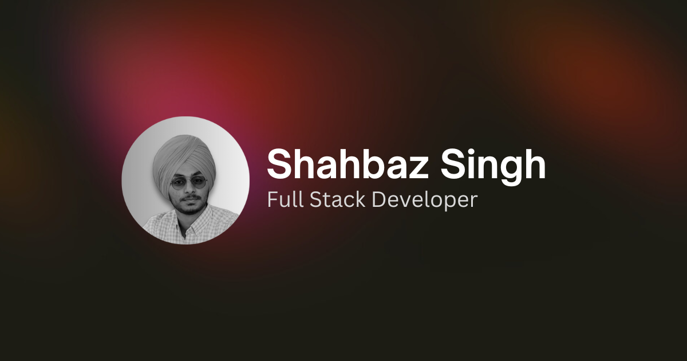

# Personal Portfolio & Blog

> A minimalist showcase of my work, thoughts, and music taste

## Overview

Welcome to my personal corner of the internet. This platform serves as a digital canvas where I showcase my projects, share my thoughts through blog posts, and give you a glimpse into my musical journey through Spotify integration.

## Features

- 🎨 Clean, minimalist design
- 📱 Fully responsive layout
- ⚡ Fast loading and optimized performance
- 🌙 Dark/light mode support
- 💼 Project showcase
- 📝 Professional experience timeline
- 📊 Real-time blog analytics
  - View counter powered by Redis
  - Like/interaction tracking
- 🎵 Spotify Integration
  - Current listening status
  - Top tracks and artists

## Tech Stack

- Next.js
- TypeScript
- Tailwind CSS
- Framer Motion
- Redis
- Spotify API

## Blog Features

- Markdown support
- Syntax highlighting
- Real-time view counter
- Interactive like button
- Responsive images
- SEO optimized
